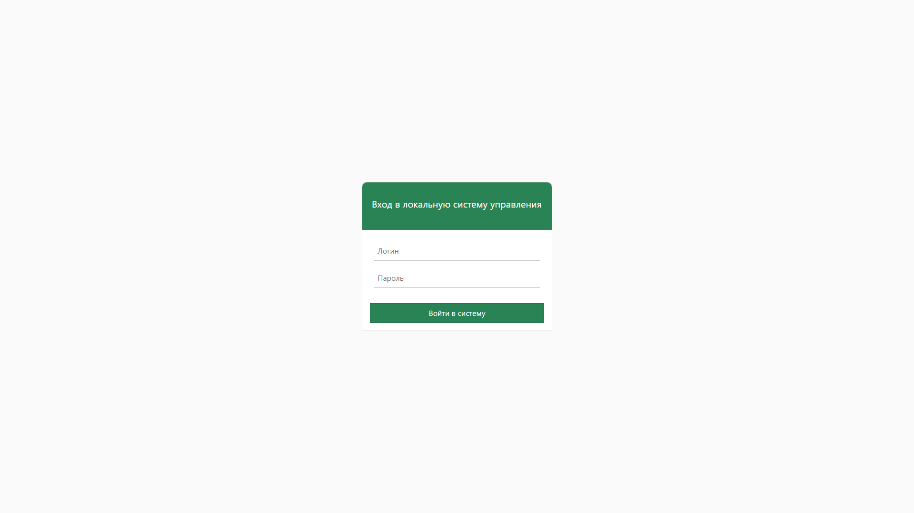
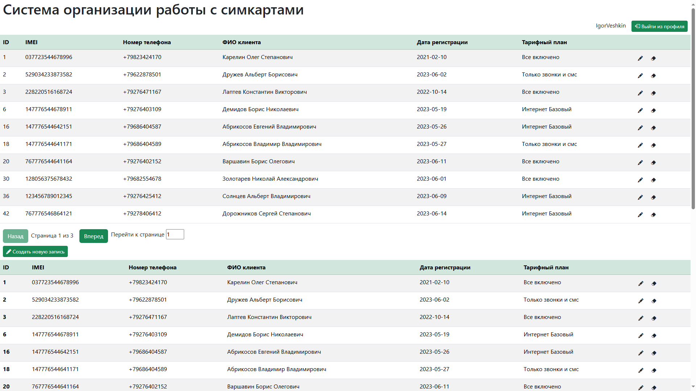
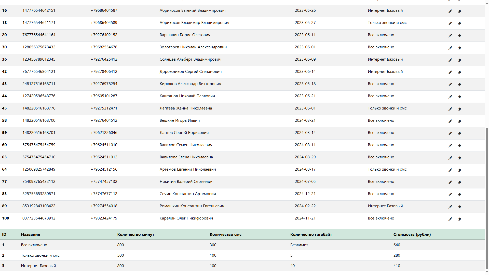
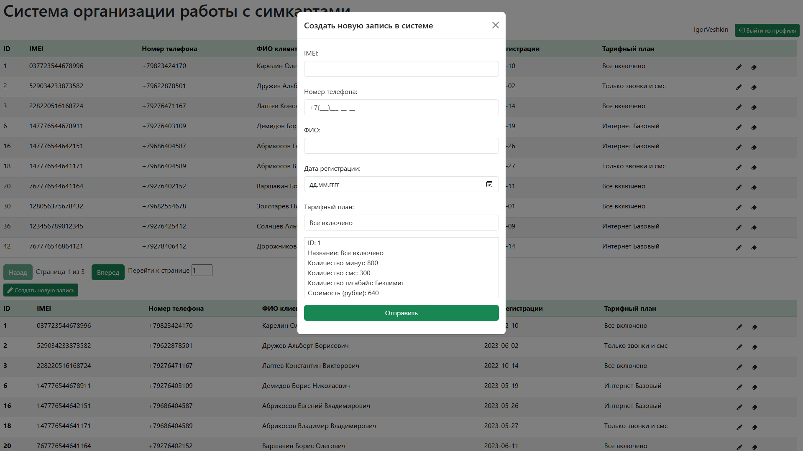
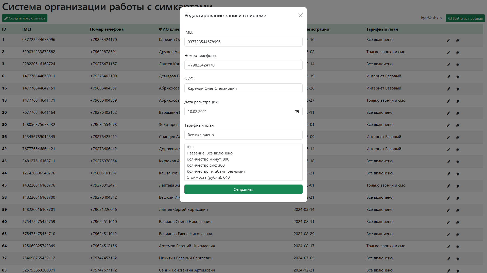
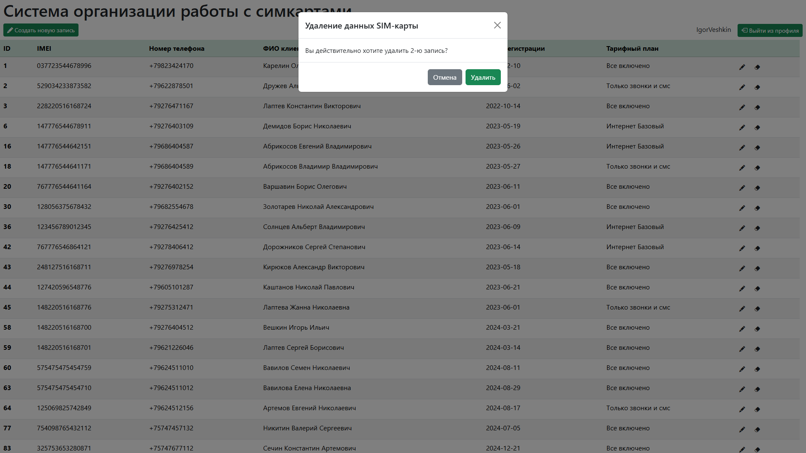
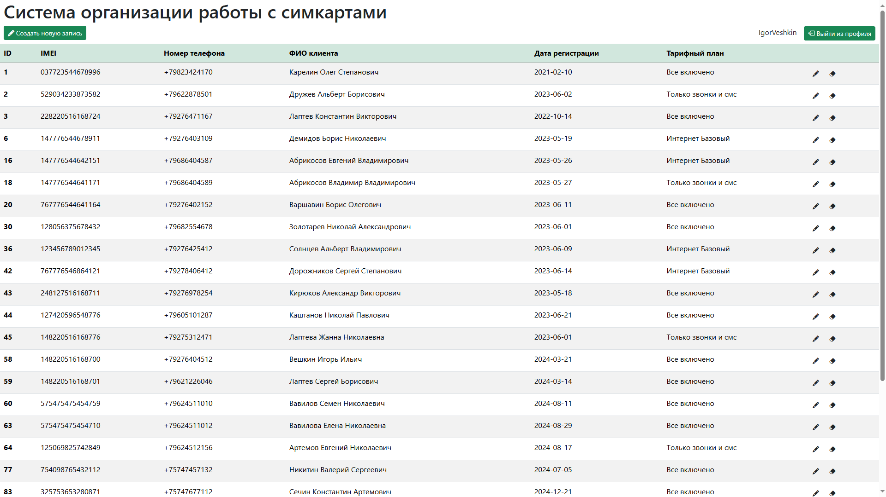
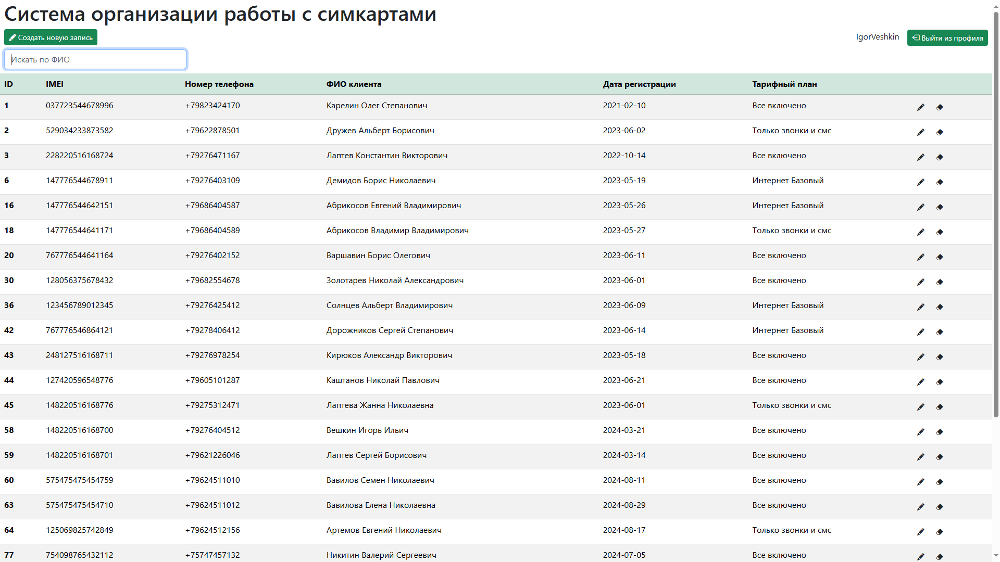
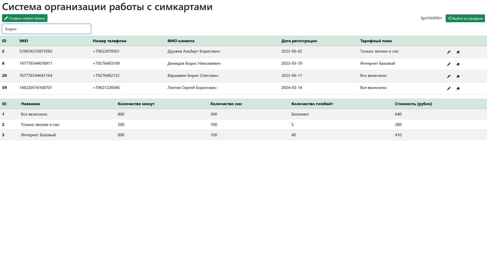
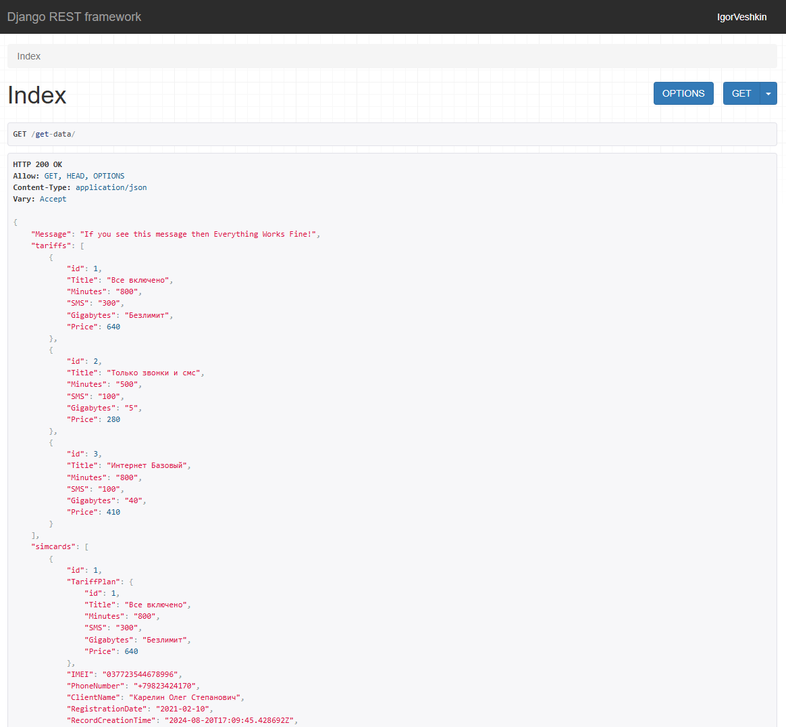

# Проект системы по организации работы с сим-картами

> Данный проект является переделанной версией проекта, доступного по ссылке: https://github.com/IgorVeshkin/Simcard_CRUD_System
> 
> (Проект доступный по ссылке выше использует стандарные инструменты рендеринга страницы Django (Django + HTML/CSS/JS))
> 
> Проект состоит из 2 частей: Backend и Frontend
> 
> В текущим репозитории представлен Backend
>
> Backend написан на Django и Django Rest Framework. Frontend написан на фреймворке React JS и был скомпилирован и настроен для работы с Django
> 
> Всего 3 билда: 
> 
> `build_normal/` - это build первоначального вида приложения (оригинальный build)
> 
> `build_with_search/` - это build c полем поиска по записям
> 
> `build/` - это build c использование хука useTable(), применяемый для тестирования расширений возможностей взаимодействия с данными таблицы (пагинация, отображение определенного количества записей на странице и так далее)
> 
> Чтобы поменять frontend-приложения, необходимо переименовать одну из дерикторий выше на `build/` и переименновать текущую папку на любую другое название и перезагрузите сервер
> 
> В проект на github также включены базы данных `db.sqlite3` и `old_simcard_db.sqlite3` (Обычно базы не добавляются в проект)
> 
> `db.sqlite3` - это база данных всего проекта
> 
> `old_simcard_db.sqlite3` - это база, предназначеная для выгрузки из неё данных и переноса их в `db.sqlite3`
> 
> В проекте прописана дополнительная команда, запускающая процесс переноса данных: `python manage.py simcard_db_import`
> 
> Логика команды `python manage.py simcard_db_import` строится на том, что данные из базы `old_simcard_db.sqlite3` считываются и переносятся в `db.sqlite3` (база должна существовать)
> 
> Если запись из `backup-базы` уже присутствует в `db.sqlite3`, то добавление производиться не будет  
>
> Для создания собственной базы данных воспользуйтесь следующими командами:
> 
> `python manage.py makemigrations` - создание файлов миграций
> 
> `python manage.py migrate` - применение файлов миграций и создание новой чистой базы данных
> 
> Для запуска сервера выполните команду: `python manage.py runserver`
> 
> Для создания пользователя-админа сайта используйте команду: `python manage.py createsuperuser`
> 
> Установка зависимостей производиться через команду `pip install -r requirements.txt`
> 
> В файле `Accounts.txt` представлены данные для входа в систему

> Примеры интерфейса:
> 
> ### 1) Страница входа в систему
> 
>
> ### 2) Главная страница с кастомной таблицей (build)
> 
>
> ### 3) Таблица тарифов (build)
> 
> 
> ### 4) Модальное окна создания новой записи клиента
> 
> 
> ### 5) Модальное окна редактирования записи клиента
> 
> 
> ### 6) Модальное окна удаления записи клиента
> 
> 
> ### 7) Главная страница (build_normal)
> 
> 
> ### 8) Главная страница (build_with_search)
> 
> 
> ### 9) Главная страница с примененным поиском по ФИО (build_with_search)
> 
> 
> ### 10) Пример получения api от django rest framework
> 
